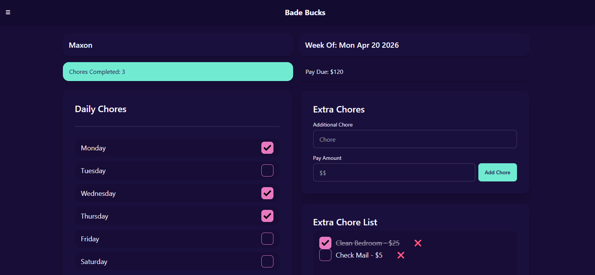
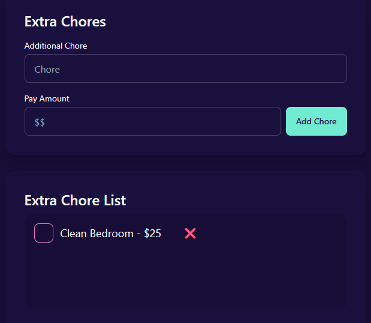
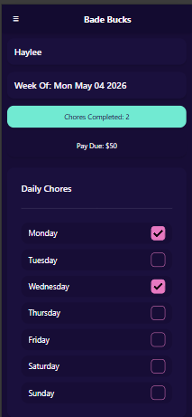

# Bade Bucks App

A full-stack chore tracking app built for my family to manage chores, extra tasks, weekly pay, and reward tracking.
Built to solve a real household workflow while practicing frontend architecture, state management, and backend integration.

---

## Live Demo

> https://brycebade.github.io/Bade-Bucks-App/

---

## Screenshots

<h3 align="center"><u>Desktop View</h3></u>

<p align="center">
   
</p>

<h3 align="center"><u>Extra Chores</h3></u>

<p align="center">
   
</p>

<h3 align="center"><u>Mobile View</h3></u>

<p align="center">
   
</p>

---

## Why I Built This

Originally created as a "fake-currency" system where kids earn rewards like screen time and privileges through completed chores.

## Features

* Select a child and week to view progress
* Track daily chores using checkboxes
* Add extra chores with custom pay amounts
* Mark extra chores complete/incomplete
* Automatically calculate total chores completed
* Dynamically calculate pay due based on rules per child
* Mark a week as paid to reset displayed balance
* Persist chore and payment data using Supabase backend storage
* Responsive layout using Tailwind/DaisyUI

---

## Tech Stack

* HTML
* CSS / Tailwind / DaisyUI
* JavaScript (ES6+)
* Supabase

---

## Current Focus

This project is actively being refactored into smaller modules to improve maintainability and scalability as new features are added.

## How to Run Locally

1. Clone the repository

   ```bash
   git clone https://github.com/brycebade/Bade-Bucks-App.git
   ```

2. Open the project folder

3. Open `index.html` in your browser
   *(or use Live Server in VS Code for a better experience)*

---

## Project Structure

* `index.html` → Main layout and UI structure
* `style.css` → Custom styling (if applicable)
* `index.js` → App initialization and event wiring
* `dom.js` → Centralized DOM queries and reusable element references
* `render.js` → UI rendering logic
* `calculations.js` → Pay and chore calculations
* `storage.js` → Supabase/database interactions
* `summary.js` → Summary/state display logic
* `data.js` → Default data structures

---

## Key Concepts Implemented

* DOM manipulation (updating UI dynamically)
* Event listeners (click, change, keydown)
* Working with nested data structures
  *(children → weeks → days)*
* Array methods like `find()` and iteration loops
* State management between UI and data
* Synchronizing frontend state with backend data

---

## What I Learned

* How to manage application state across UI, local data, and backend persistence
* How to structure and access nested objects safely
* How event-driven programming works in real apps
* How small bugs in logic (like incorrect references or scope issues) can break functionality
* The importance of resetting UI correctly when switching between selections

---

## Future Improvements

* Add authentication and user roles (parent vs child)
* Create user accounts for each child
* Improve mobile responsiveness and layout
* Add rewards/store system for spending earned money
* Add weekly summaries and history tracking

---

## Author

Bryce Bade

---

### Challenges Faced

One of the biggest challenges was keeping UI state synchronized between selected children, weeks, chore checkboxes, extra chores, and backend persistence without causing stale or incorrect calculations.

---

## Notes

The goal of this project is to build a practical real-world application while improving software design, state management, and backend integration skills.
